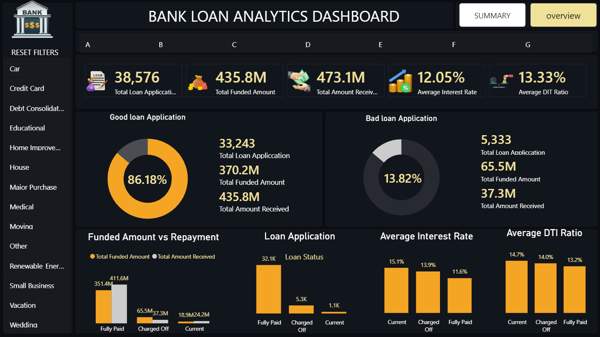
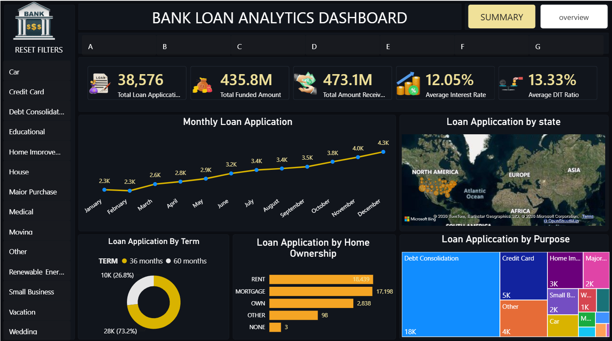

# Bank Loan Analytics Dashboard

## Project Overview

This project is an interactive Bank Loan Analytics Dashboard created using Microsoft Power BI.

The dashboard analyzes loan applications, funded amounts, repayments, loan status, interest rates, DTI ratio, loan purposes, loan terms, home ownership, and monthly application trends.

## Tools Used

- Microsoft Power BI
- Power Query
- DAX
- Data Cleaning
- Data Transformation
- Data Visualization

### Summary

The Summary page provides an overview of loan performance using key metrics such as total loan applications, funded amount, amount received, average interest rate, average DTI ratio, good loans, bad loans, and loan status.

### Overview

The Overview page provides detailed analysis of loan applications based on monthly trends, state, loan term, home ownership, and loan purpose.

## Dashboard Preview

### Summary Dashboard

### Overview Dashboard

## Key Insights

- Total Loan Applications: 38,576
- Total Funded Amount: 435.8M
- Total Amount Received: 473.1M
- Average Interest Rate: 12.05%
- Average DTI Ratio: 13.33%
- Good Loan Applications: 33,243
- Bad Loan Applications: 5,333
- Good Loan Percentage: 86.18%
- Bad Loan Percentage: 13.82%

## Business Questions

- What is the total number of loan applications?
- What is the total funded amount?
- How much repayment was received?
- What percentage of loans are good or bad?
- Which loan purpose has the highest number of applications?
- How do loan applications change over time?
- Which home ownership category has the most applications?
- How does interest rate vary by loan status?
- How does DTI ratio vary by loan status?

## Project Structure

bank-loan-analytics-powerbi/

- README.md
- PowerBI/
  - Bank_Loan_Analytics_Dashboard.pbix
- Dataset/
  - Financial_loan_data.xlsx

## Conclusion

This project demonstrates the use of Power BI for data cleaning, transformation, DAX calculations, data analysis, and interactive dashboard development. It provides useful insights into loan applications, funding, repayments, and loan performance.
